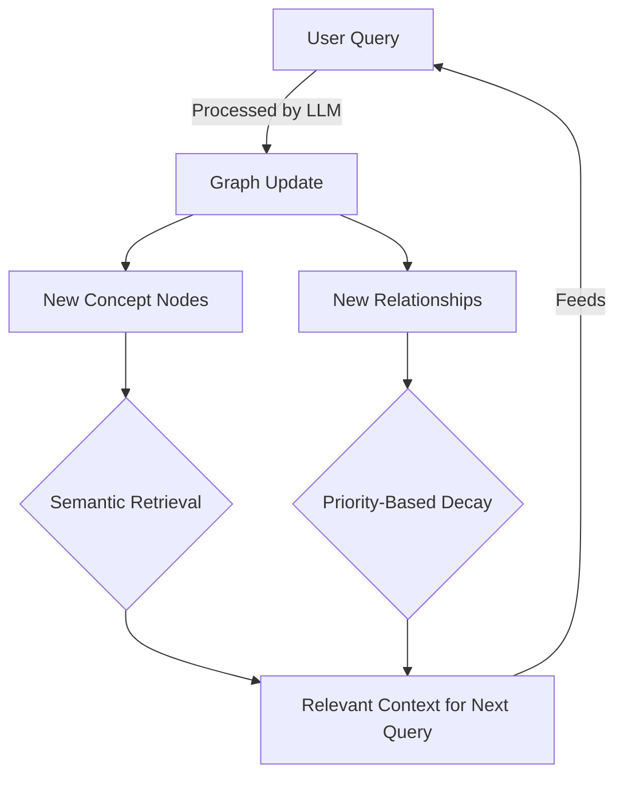

# Graph of Thoughts: Knowledge Graph Memory for LLMs

> **⚠️ WARNING:** This is an experimental work-in-progress project exploring new approaches to LLM memory management. I'm a developer new to the AI space, and I welcome feedback and contributions!

## Table of Contents
- [Overview](#overview)
- [The Challenge of LLM Memory](#the-challenge-of-llm-memory)
- [My Approach: Structured Memory as a Graph](#my-approach-structured-memory-as-a-graph)
- [Core Concepts](#core-concepts)
- [Getting Started](#getting-started)
- [File Structure](#file-structure)
- [Usage](#usage)
- [Future Directions](#future-directions)
- [License](#license)
- [Contributing](#contributing)

## Overview

Graph of Thoughts implements a dynamic knowledge graph memory system for Large Language Models, enabling them to maintain more coherent context across long conversations by structuring information as a semantic graph rather than a linear token sequence.



## The Challenge of LLM Memory

Large Language Models typically handle context through a linear sequence of tokens, leading to several limitations:

- **Limited Memory Span**: Context windows have a fixed size, causing distant information to be forgotten.
- **No Prioritization**: All context receives equal importance regardless of relevance.
- **Linear Structure**: Relationships between concepts aren't explicitly captured.
- **Inconsistency**: LLMs can lose track of their own reasoning across long conversations.

## My Approach: Structured Memory as a Graph

Graph of Thoughts is an experimental approach I'm developing to improve inference without training or fine-tuning. Instead of treating conversation history as a flat token sequence, this method structures memory as a dynamic knowledge graph that enables:

- **Semantic Retrieval**: Fetch only the most relevant context based on similarity.
- **Priority-Based Decay**: More important or recent information persists longer.
- **Relationship Preservation**: Explicitly capture concept connections.
- **Reasoning Traceability**: Follow the model's thought process through graph exploration.

## Core Concepts

<details>
<summary><b>1. Memory as a Graph Structure</b></summary>

Instead of a token window, I store information in a directed graph where:

- Nodes represent concepts, facts, or user inputs.
- Edges capture relationships and dependencies between nodes.
- Embeddings enable semantic similarity search.
- Importance scores determine which nodes to keep or prune.
</details>

<details>
<summary><b>2. LLM-Generated Structure</b></summary>

The LLM itself contributes to its memory structure by:

- Generating structured JSON representing its reasoning process.
- Identifying key concepts and relationships.
- Updating the graph with new knowledge.
- Following chains of thought through the graph.
</details>

<details>
<summary><b>3. Dynamic Context Management</b></summary>

To maintain relevant context without overloading the model:

- The system retrieves semantically similar nodes for each query.
- Node importance decays over time to filter out noise.
- Less relevant information is pruned when the graph grows too large.
- Critical reasoning paths are preserved, even as fine details fade.
</details>

## Getting Started

### Installation

```bash
pip install -r requirements.txt
```

## File Structure

```
graph-of-thoughts/
├── core/
│   ├── graph.py          # Graph data structure implementation
│   ├── embedding.py      # Semantic embedding generation
│   ├── retrieval.py      # Context retrieval mechanisms
│   └── decay.py          # Priority-based decay functions
├── utils/
│   ├── visualization.py  # Graph visualization tools
│   └── metrics.py        # Performance evaluation
├── examples/
│   ├── simple_chat.py    # Basic chat example
│   └── reasoning.py      # Complex reasoning example
├── tests/                # Unit and integration tests
├── requirements.txt
└── README.md
```

## Usage
**Coming soon!**

## Future Directions

I'm actively exploring:

- Reinforcement learning for optimizing decay functions.
- Multi-modal graphs incorporating images and code.
- Hierarchical summarization for pruning without information loss.
- Knowledge distillation between graph instances.

## License

MIT License

## Contributing

This is a solo project, but I'm open to feedback! Feel free to reach out with questions or suggestions.